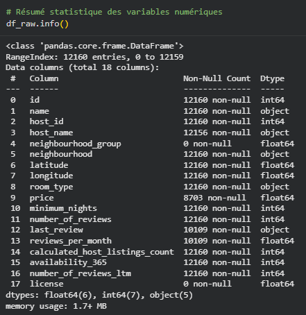
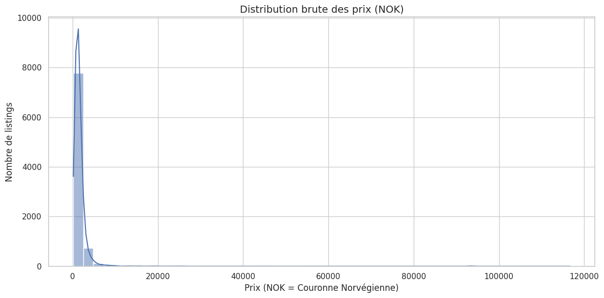
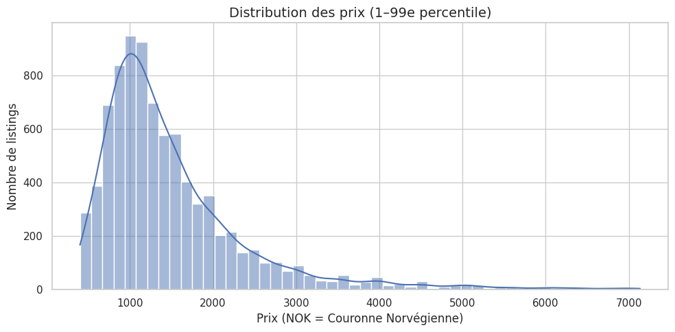
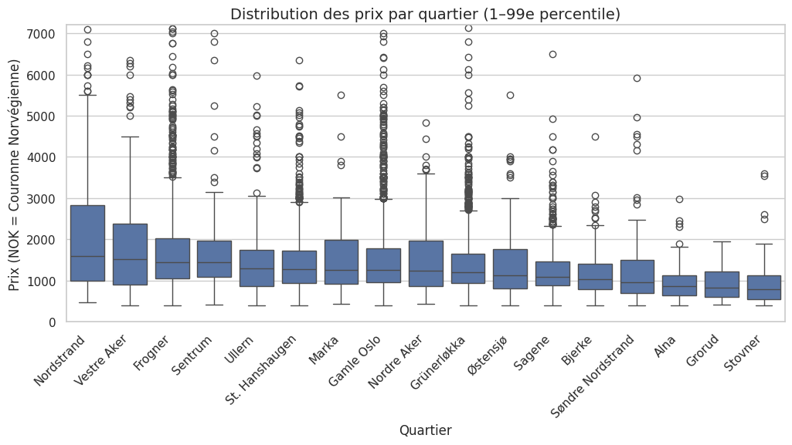
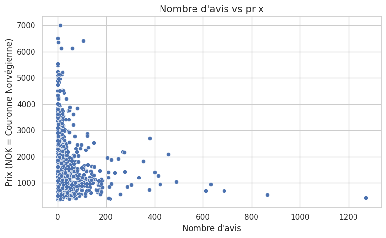
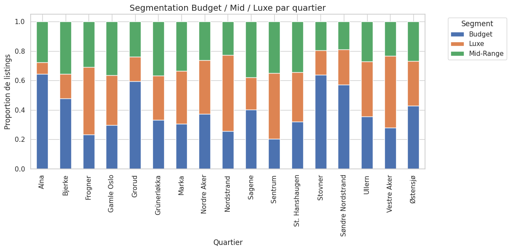
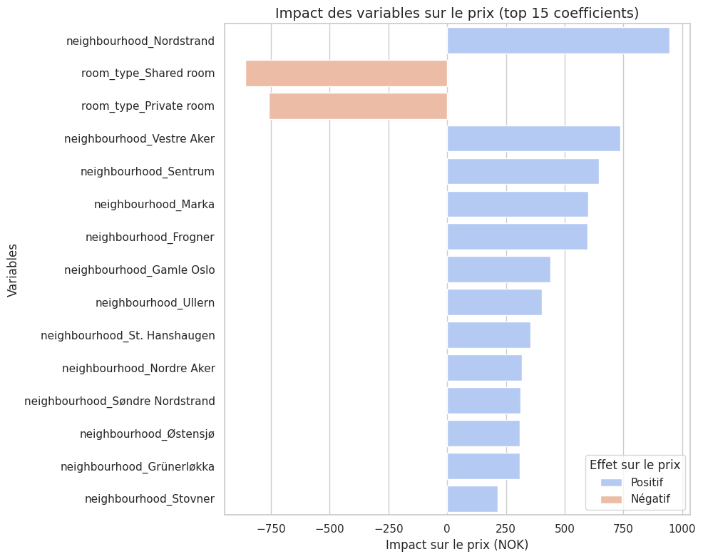

# Analyse du marché Airbnb : Oslo
### Projet de groupe – M2 CMSI

---

## Contexte & Objectifs

**Objectifs du projet :**
*   Comprendre la dynamique du marché locatif saisonnier à Oslo.
*   Identifier les facteurs déterminants du prix (localisation prémium vs budget).
*   Détecter les opportunités d'investissement (quartiers sous-évalués, demande non satisfaite).

**Méthodologie :**
*   **Données :** InsideAirbnb (listings Oslo).
*   **Approche :** Nettoyage rigoureux, EDA (Exploratory Data Analysis), Segmentation, et Modélisation (Régression Linéaire).

---

## Vue d’ensemble du dataset

*   **Données brutes :** ~12 000 listings.
*   **Données nettoyées :** ~8 700 listings exploitables (avec prix).
*   **Variables clés :** `price`, `neighbourhood`, `room_type`, `number_of_reviews`, `availability_365`.

<!-- Insérer ici une capture du df.head() ou df.info() issue du notebook -->

---

## Distribution des Prix (Avant Nettoyage)

*   Distribution très asymétrique (longue traîne à droite).
*   Présence de valeurs extrêmes (outliers) nécessitant un filtrage pour une analyse économique pertinente.

<!-- Insérer ici l'histogramme des prix bruts ou log(price) -->

---

## Distribution des Prix (Après Nettoyage)

**Zoom sur le cœur du marché (1er - 99ème centile) :**
*   La majorité des offres se situe dans une fourchette standard.
*   Exclusion des prix aberrants pour fiabiliser la modélisation.

<!-- Insérer ici l'histogramme des prix filtrés -->

---

## Analyse par Quartiers

**Disparités géographiques :**
*   Les quartiers centraux (ex: Frogner, Sentrum) affichent les prix médians les plus élevés.
*   Les quartiers périphériques offrent des alternatives plus abordables.

<!-- Insérer ici le Boxplot : Prix par Quartier -->

---

## Analyse des Hôtes & Avis

*   **Corrélation faible** entre prix et nombre d'avis.
*   **Disponibilité :** Les logements très disponibles avec peu d'avis signalent souvent des nouveautés ou des prix inadaptés.
*   **Demande :** Forte tension sur les biens "Budget" bien situés.

<!-- Insérer ici le Scatterplot : Reviews vs Availability ou Prix vs Reviews -->

---

## Segmentation de l'Offre

Une segmentation **Budget / Mid / Luxe** a été établie basée sur les terciles de prix.

*   **Budget :** Chambres privées et studettes excentrées.
*   **Luxe :** Grands appartements entiers dans les quartiers prisés (Frogner).

<!-- Insérer ici le graphique de la segmentation (Barplot ou Stacked) -->

---

## Modélisation : Régression Linéaire

**Performance du modèle :**
*   **R² ≈ 0.18** : Le modèle explique ~18% de la variance des prix.
*   **Interprétation :** Le prix Airbnb dépend fortement de variables qualitatives (déco, vue, standing) absentes de ce dataset simplifié.

**Coefficients majeurs :**
*   `Room Type` (Logement entier) : Impact positif le plus fort.
*   `Neighbourhood` : Impact significatif mais secondaire.

<!-- Insérer ici le tableau des résultats R2/RMSE ou le graphique des coefficients -->

---

## Insights Clés (Synthèse)

1.  **Structure de l'offre** : Dominée par les "Entire home/apt", ce qui tire les prix vers le haut.
2.  **Localisation** : Frogner et Sentrum sont les zones "Premium".
3.  **Demande** : Les biens abordables (< 1000 NOK) concentrent le volume d'avis, suggérant une forte demande touristique budget.
4.  **Professionnalisation** : Les multi-propriétaires sont présents et adoptent souvent une stratégie de prix plus agressifs (volume).

---

## Recommandations Stratégiques

Pour un investisseur :

*   **Opportunité "Luxe"** : Investir dans de grandes surfaces à **Frogner** (ticket d'entrée élevé mais rentabilité potentielle sur le prix nuitée).
*   **Opportunité "Rendement"** : Cibler **Gamle Oslo** ou **Grünerløkka** avec des petites surfaces (studio/2 pièces) optimisées pour le court séjour (taux d'occupation élevé).
*   **Attention** : Éviter les "Private Rooms" sauf si l'objectif est un complément de revenu, car la rentabilité est nettement inférieure.

---

## Conclusion & Limites

**Conclusion :**
Le marché d'Oslo est mature, structuré autour du centre-ville et fortement segmenté par le type de bien. La localisation reste un marqueur fort de valeur.

**Limites de l'analyse :**
*   **Données statiques (Snapshot)** : Ne capture pas la saisonnalité fine.
*   **Manque de features** : Pas de données sur la qualité intérieure, l'étage ou la vue, cruciaux pour le prix.
*   **Prix affichés vs Réels** : Le prix de transaction réel peut différer (frais, promos).
